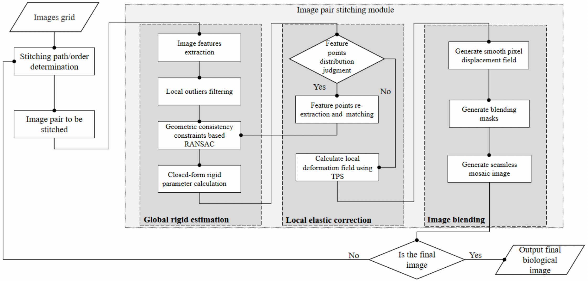
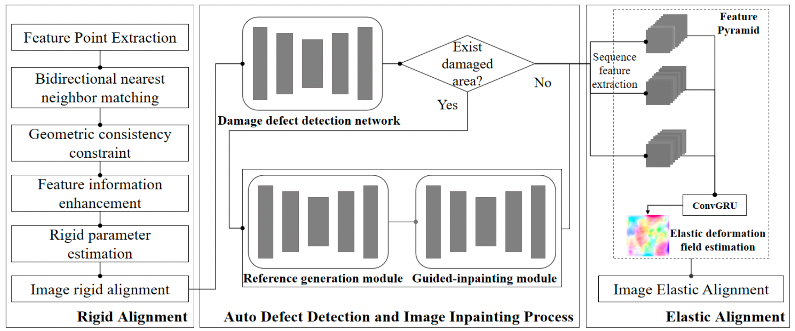
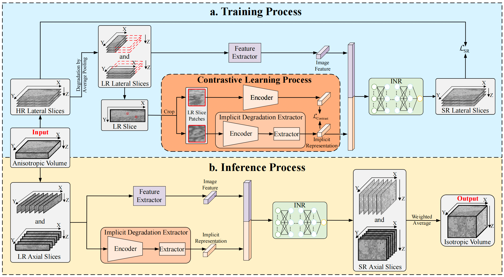
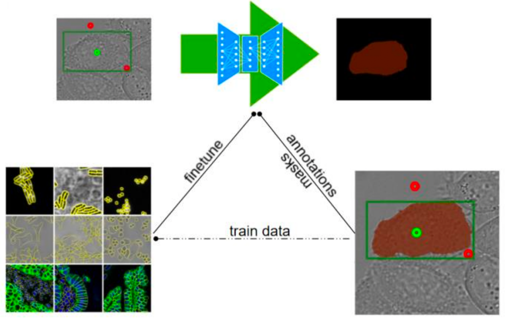

# 🔬 Towards High-Resolution 3D Reconstruction in Volume Electron Microscopy

The project aims to build a **full-pipeline image processing platform for Volume Electron Microscopy (VEM)**，enabling automated stitching, alignment, restoration, reconstruction, and segmentation of high-resolution, large-scale biological 3D structures.
Built upon the team’s series of research contributions published in top-tier venues such as **NeurIPS, AAAI, ACM Multimedia, and GigaScience**，this project seeks to deliver a **reproducible, extensible, and interactive** VEM processing toolkit.

---

## 📌 Background

Volume Electron Microscopy (VEM) is a revolutionary biological imaging technology, recognized by *Nature* as one of the **“Seven Technologies to Watch in 2023”**. It enables nanoscale-resolution visualization of the three-dimensional structures of cells, tissues, and even small organisms.

However, the VEM data processing workflow is highly complex and typically involves the following stages:

1. **2D Image Stitching**  
2. **3D Slice Alignment / Registration**  
3. **Slice Damage Restoration & Axial Interpolation (Inpainting / Axial Flow)**  
4. **Isotropic 3D Reconstruction**  
5. **3D Structural Segmentation**

This project aims to develop an AI-driven system that covers the *entire* VEM processing pipeline, enabling researchers to efficiently complete the full workflow from **raw slices → 3D volume reconstruction → biological analysis**.

---

## 🎯 Goals and Objectives

Despite substantial progress in VEM methodologies, several key challenges remain unresolved:

1. Accurately matching image features within complex biological structures while modeling both global rigidity and local elastic deformation for precise stitching.  
2. Preserving Z-axis structural coherence, restoring damaged slices faithfully, and distinguishing natural biological deformation from nonlinear imaging artifacts.  
3. Achieving isotropic 3D reconstruction at arbitrary resolutions through implicit neural representations.  
4. Leveraging minimal prompt information with large pre-trained models to enable accurate segmentation of diverse biological structures.

To address these challenges, the following objectives are defined:

### 🔹 Objective 1: High-Precision Image Stitching
Develop a stitching framework capable of handling both global rigid alignment and local elastic deformation, enabling accurate feature matching and producing seamless, high-resolution panoramic slices.

### 🔹 Objective 2: Accurate 3D Alignment
Design a 3D alignment method that incorporates slice-damage repair using axial structural continuity. Axial optical flow will capture Z-axis structural changes, while learned deformation fields correct nonlinear distortions to restore natural biological geometry.

### 🔹 Objective 3: Self-Supervised 3D Reconstruction
Introduce a self-supervised reconstruction approach based on implicit neural representations to generate high-fidelity, isotropic 3D volumes at multiple resolutions using continuous positional encoding and artifact-free interpolation.

### 🔹 Objective 4: Efficient 3D Structure Segmentation
Develop a large pre-trained model for VEM segmentation, enabling zero-shot transfer and interactive prompt-based refinement to accurately segment diverse organelles and complex cellular structures with minimal manual annotation.

**In summary**, these objectives aim to overcome key barriers in VEM processing, advancing high-resolution 3D reconstruction and unlocking deeper insights into complex biological systems for health and life science research.

---

## 🛠️ Technical Approach & Methodology

To accomplish the goals and objectives, this project adopts a four-part technical framework covering stitching, alignment, reconstruction, and segmentation.

---

### 🔹 1. Feature-Based 2D Image Stitching  
We implement a stitching pipeline that extracts scale-invariant feature points, matches feature pairs, and jointly models global rigid transformations and local elastic deformations. This enables seamless, high-resolution slice panoramas even under slight rotations or nonlinear distortions. The process includes determining stitching order, feature extraction, feature matching, global rigid estimation, local elastic correction, and image fusion.

  

- 📄 Paper: [vEMstitch: an algorithm for fully automatic image stitching of volume electron microscopy](https://doi.org/10.1093/gigascience/giae076), **GigaScience 2024**  
   
- 💻 Code: https://github.com/HeracleBT/vEMstitch

---

### 🔹 2. Image Alignment with Integrated Slice Restoration  
We design a slice alignment scheme that incorporates both rigid registration and damage restoration. Edge feature points guide reliable rigid alignment, while axial optical flow captures Z-axis structural continuity to restore corrupted slices. A recurrent neural network is then applied to the entire sequence to correct long-range nonlinear deformation and cumulative errors. This ensures faithful structural coherence and high-quality 3D alignment.

  

- 📄 Paper: [Unsupervised Trajectory Optimization for 3D Registration in Serial Section Electron Microscopy using Neural ODEs](https://neurips.cc/virtual/2025/loc/san-diego/poster/120149), **NeurIPS 2025**  
   
- 💻 Code: 

- 📄 Paper: [A Gaussian Filter-Based 3D Registration Method for Series Section Electron Microscopy](https://doi.org/10.1609/aaai.v39i1.32103), **AAAI 2025**  
   
- 💻 Code: 

- 📄 Paper: [Serial Section Microscopy Image Inpainting Guided by Axial Optical Flow](https://dl.acm.org/doi/abs/10.1145/3664647.3681023), **ACM Multimedia 2024**  
   
- 💻 Code: 

---

### 🔹 3. Implicit Neural Representation (INR)–Based 3D Reconstruction  
To achieve isotropic reconstruction, we propose **vEMINR**, a fast self-supervised isotropic reconstruction framework that uses high-resolution XY slices as supervision to guide the recovery of missing axial information. A lightweight MLP learns continuous implicit representations of real vEM textures, enabling accurate decoding of low-resolution axial signals into the high-resolution space at any coordinate without costly image-generation steps.  

  

💻 Code: https://github.com/KysonYang001/vEMINR

---

### 🔹 4. Interactive Large Model for 3D Volume Segmentation  
We aim to build a large pretrained segmentation model for VEM data, leveraging the growing EMDB database. Through prompt-based interaction and minimal transfer learning, experts can efficiently guide the model to segment diverse organelles and cellular structures. This approach improves annotation efficiency and supports broad generalization across imaging modalities and targets.

  

